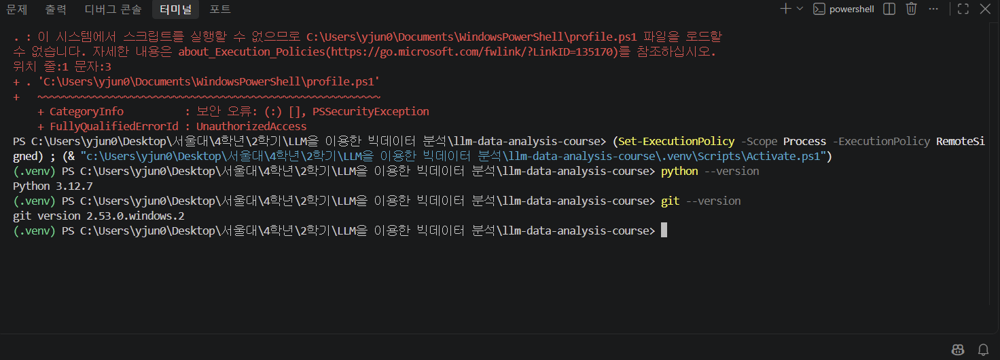
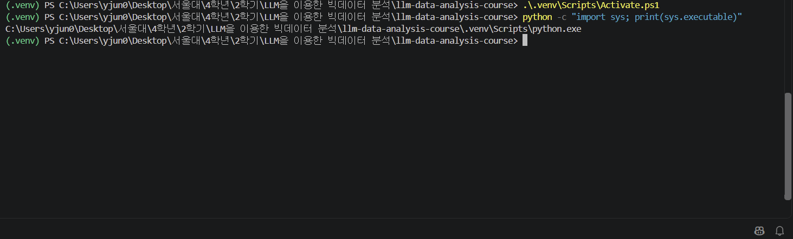
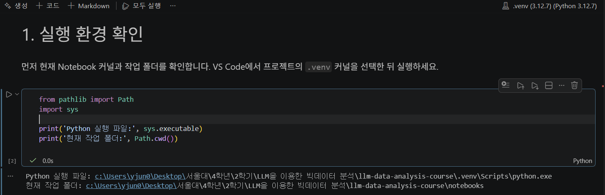
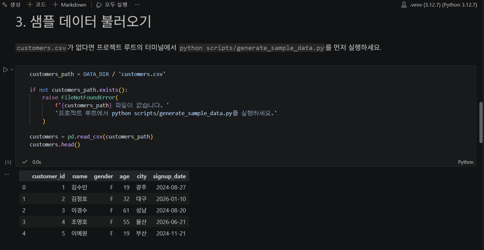
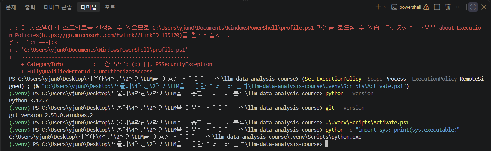
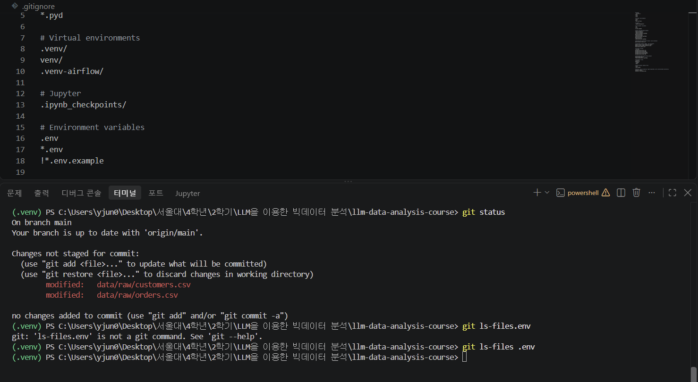

# Chapter 02 제출 답안. VS Code에서 시작하는 데이터 분석 환경

> 최종 파일은 개인 GitHub 저장소의 `chapter02/chapter02.md`로 저장하는 것을 권장합니다.

## 0. 제출 정보

- 이름: 김용준
- GitHub ID: rotcev40
- 개인 저장소: `llm-data-analysis-study`
- 작성일: 2026-09-16
- 운영체제: Windows 11 Home

### 최종 제출 URL

```text
https://github.com/rotcev40/llm-data-analysis-study/blob/main/chapter02/chapter02.md
```

---

## 1. Python과 Git 환경 확인

### 실행 내용

```text
python --version
git --version
```

### 실행 결과

```text
Python 3.12.7
git version 2.53.0.windows.2
```

### Evidence



### 결과 관찰

`python --version`은 `Python 3.12.7`, `git --version`은 `git version 2.53.0.windows.2`를 출력했다. 두 명령 모두 오류 없이 실행되었다.

### 나의 해석과 판단

교재가 요구하는 Python 3.12 이상 조건을 만족하므로 `requirements.txt`에 고정된 패키지 버전을 그대로 설치할 수 있다고 판단했다. Git도 설치되어 있어 저장소 clone과 이후 commit 작업이 가능하다.

### 업무·분석적 의미

버전이 맞지 않으면 패키지 설치 단계에서 실패하거나 패키지 사용 단계에서 오류가 발생할 수 있다. 시작 전에 확인해 두는 것이 추후 문제가 발생했을 때의 분석에도 도움이 될 것 같다.

### 한계와 추가 확인 사항

여기서 확인한 것은 명령이 실행된다는 사실과 버전뿐이다. 이 `python`이 어떤 실행 파일인지는 확인하지 않았다. 시스템에 Anaconda와 별도 설치 Python이 함께 있어 다음 단계에서 실제 실행 경로를 확인해야 한다.

---

## 2. 저장소와 `.venv` 준비

### 수행 내용

- [x] 공식 Public 저장소 clone
- [x] 프로젝트 루트 확인
- [x] `.venv` 생성
- [x] `.venv` 활성화
- [x] `requirements.txt` 설치

### 핵심 실행 결과

```text
현재 프로젝트 경로: C:\Users\yjun0\Desktop\서울대\4학년\2학기\LLM을 이용한 빅데이터 분석\llm-data-analysis-course
터미널 Python 실행 파일: C:\Users\yjun0\Desktop\서울대\4학년\2학기\LLM을 이용한 빅데이터 분석\llm-data-analysis-course\.venv\Scripts\python.exe
가상환경 활성화 여부: 프롬프트 앞에 (.venv) 표시됨
패키지 설치 결과: requirements.txt의 21개 패키지 설치 완료, pip는 24.2에서 26.2.1로 업그레이드
```

### Evidence



### 결과 관찰

활성화 후 `python`은 프로젝트 폴더 안의 `.venv\Scripts\python.exe`를 가리켰다. 활성화 전에는 Anaconda의 `python.exe`가 사용되고 있었다.

### 나의 해석과 판단

예전에 사용하던 Python 3.9, 3.10이 Anaconda와 별개로 함께 있어서 패키지가 어디에 설치될지 명확하지 않고, 충돌의 위험이 있다. 프로젝트마다 `.venv`를 두면 설치 위치가 한 곳으로 고정되므로 다른 과목이나 프로젝트에서 쓰는 버전과 충돌하지 않을 것이다.

### 업무·분석적 의미

`requirements.txt`와 `.venv`가 함께 있으면 다른 사람이 같은 버전으로 환경을 다시 만들 수 있다. 오류 발생 시 코드 문제인지 환경 문제인지 구분하기도 쉬워진다.

### 한계와 추가 확인 사항

PowerShell 실행 정책이 기본값이어서 프로필 스크립트 로드가 차단되어 오류 메시지가 떴다. 이와 관련된 내용은 troubleshooting으로 다루었다.

---

## 3. VS Code 인터프리터와 Jupyter 커널 연결

### 확인 결과

```text
VS Code Python 인터프리터: .venv (3.12.7) (Python 3.12.7)
Notebook sys.executable: C:\Users\yjun0\Desktop\서울대\4학년\2학기\LLM을 이용한 빅데이터 분석\llm-data-analysis-course\.venv\Scripts\python.exe
Notebook Path.cwd(): C:\Users\yjun0\Desktop\서울대\4학년\2학기\LLM을 이용한 빅데이터 분석\llm-data-analysis-course\notebooks
```

### Evidence



### 결과 관찰

터미널과 Notebook이 모두 같은 `.venv\Scripts\python.exe`를 사용했다. 작업 폴더는 터미널이 프로젝트 루트, Notebook이 `notebooks` 폴더로 서로 달랐다.

### 나의 해석과 판단

둘이 다른 Python을 사용하면 터미널에서 설치한 패키지를 Notebook이 찾지 못한다고 생각했다. 작업 폴더가 다른 것은 특정 경우 문제가 될 수 있는데, 이번 Notebook은 상위폴더까지 확인하도록 되어있어 두 경우 모두 동작했다.

### 업무·분석적 의미

패키지를 설치한 환경과 코드를 실행하는 환경이 같은지 먼저 확인해두면 `ModuleNotFoundError`가 났을 때 설치를 반복하는 대신 커널 설정을 먼저 보게 된다.

### 한계와 추가 확인 사항

커널 이름에 `.venv`가 표시되어도 같은 이름을 가진 다른 위치의 가상환경일 수 있다. 이번에는 `sys.executable`의 전체 경로까지 확인하였고, 앞으로도 조심해야 할 부분인 것 같다.

---

## 4. 샘플 데이터와 Notebook 실행 검증

### 확인 결과

```text
DATA_DIR 존재 여부: True
customers.csv 존재 여부: True
customers.shape: (150, 6)
주요 컬럼: customer_id, name, gender, age, city, signup_date
```

### Evidence



### 결과 관찰

`customers.head()`가 출력되었고 6개의 column이 모두 보였다. 데이터의 크기는 150행 6열이었고 `customer_id`는 1부터 순서대로였다.

### 나의 해석과 판단

Notebook 커널, 설치된 패키지, 데이터 경로가 모두 잘 연결되었다. pandas import, 데이터 폴더 탐색, CSV 읽기가 한 번에 성공했기 때문이다.

### 업무·분석적 의미

`customers.head()` 함수를 통해 데이터의 전반적인 구조와 예시 데이터를 알 수 있다. 이는 데이터를 이해하기 위한 초석이 될 수 있다. 

### 한계와 추가 확인 사항

head() 함수를 사용한다고 해서 데이터의 품질을 알 수 있는 것은 아니라는 점이 한계이다.

---

## 5. 오류 해결 기록

실습 중 오류가 있었다면 작성합니다. 오류가 없었다면 `해당 없음`이라고 적습니다.

### 오류 메시지

```text
. : 이 시스템에서 스크립트를 실행할 수 없으므로 C:\Users\yjun0\Documents\WindowsPowerShell\profile.ps1 파일을 로드할 수 없습니다. 자세한 내용은 about_Execution_Policies(https://go.microsoft.com/fwlink/?LinkID=135170)를 참조하십시오.
위치 줄:1 문자:3
+ . 'C:\Users\yjun0\Documents\WindowsPowerShell\profile.ps1'
+   ~~~~~~~~~~~~~~~~~~~~~~~~~~~~~~~~~~~~~~~~~~~~~~~~~~~~~~~~
    + CategoryInfo          : 보안 오류: (:) [], PSSecurityException
    + FullyQualifiedErrorId : UnauthorizedAccess
```

### 원인 후보

1. PowerShell 실행 정책이 스크립트 실행을 허용하지 않음
2. `profile.ps1` 파일 자체의 내용 문제
3. 가상환경 활성화 스크립트 경로 문제

### 내가 확인한 순서

1. 오류 메시지에서 차단된 대상이 `profile.ps1`인지 `Activate.ps1`인지 확인
2. 오류가 난 뒤에도 프롬프트에 `(.venv)`가 표시되는지 확인
3. `python -c "import sys; print(sys.executable)"`로 실제 Python 경로 확인

### 해결 방법

```text
Claude Opus 5의 도움을 받아 Trouble Shooting을 시도했으며, 이 부분의 답안 작성에 도움을 받았다.

VS Code Python 확장이 터미널 활성화 과정에서 Set-ExecutionPolicy -Scope Process -ExecutionPolicy RemoteSigned를 실행한 뒤 Activate.ps1을 호출했고, 이후 가상환경이 정상적으로 활성화되었다. 실행 정책을 직접 변경하지는 않았다.
```

### Evidence



### 나의 해석과 판단

오류 메시지가 가리킨 파일이 `Activate.ps1`이 아니라 `profile.ps1`이었고, 오류 이후에도 가상환경 활성화와 Python 경로 확인이 정상적으로 되었다. 따라서 실행 정책이 PowerShell 프로필 로드만 막았을 뿐 실습 진행에는 영향을 주지 않는다고 결론 지었다.

### 한계와 추가 확인 사항

실행 정책을 `CurrentUser`나 `LocalMachine` 범위로 바꾸지는 않았다. 개인 PC이지만 범위를 넓히면 의도하지 않은 스크립트까지 실행될 수 있어 필요한 범위에서만 완화하는 편이 낫다고 보았다. `profile.ps1`에 어떤 설정이 들어 있고 로드되지 않아 빠진 것이 있는지는 확인하지 않았다.

---

## 6. Secret 보호 확인

- [x] `.env`는 Git 추적 대상이 아닙니다.
- [x] 실제 API Key를 코드에 작성하지 않았습니다.
- [x] 캡처 화면에 Token/비밀번호가 없습니다.
- [x] `.venv`를 Git에 올리지 않습니다.

### Evidence



### 나의 해석과 판단

`git status`와 `git ls-files .env` 결과에 `.env`가 나타나지 않아 Git 추적 대상이 아님을 확인했다. Key를 코드에 직접 적으면 파일을 공유하거나 Public 저장소에 올리는 순간 그대로 노출되고, 한 번 커밋되면 파일을 지워도 기록에 남는다. 값은 `.env`에 두고 형식만 `.env.example`로 공유하면 설정 방법은 전달하면서 값은 남기지 않을 수 있다.

---

## 7. Chapter 02 최종 회고

### 가장 중요했다고 생각한 환경 설정 1가지

```text
Terminal과 Notebook이 같은 .venv를 사용하도록 인터프리터와 커널을 맞춘 것
```

### 그 이유

```text
패키지를 설치한 곳과 코드를 실행하는 곳이 다르면 설치를 반복해도 같은 오류가 계속 발생한다. 양쪽에서 sys.executable을 확인해 두 환경이 같다는 것을 확인했기 때문에, 이후 단계에서 오류가 나더라도 환경 문제는 원인 후보에서 제외할 수 있다. 이전까지 Python을 이용하여 개발을 진행할 때 가장 힘들었던 점이 환경 문제에서 발생하는 오류를 잡는 것이었는데, 환경 문제를 오류 원인 후보에서 확실히 제외할 수 있는 방법을 알았다는 점이 유의미했다.
```

### 다음 Chapter에서 재사용할 환경 체크 3가지

1. `python -c "import sys; print(sys.executable)"`로 실제 Python 실행 경로 확인
2. Notebook에서 `sys.executable`과 `Path.cwd()` 출력 확인
3. 데이터 폴더 존재 여부와 CSV 로딩 확인

### 현재 환경의 한계 또는 주의점

```text
프로젝트 경로에 한글과 공백이 있어 경로를 그대로 다루는 도구에서는 문제가 생길 수 있다. 시스템에 Python이 여러 개 설치되어 있으므로 가상환경을 활성화하지 않은 터미널에서는 다른 Python이 사용된다.
```

---

## 최종 제출 체크

- [x] 핵심 Evidence 4~7장을 첨부했습니다.
- [x] 단순 캡처가 아니라 관찰과 판단을 작성했습니다.
- [x] Secret/개인정보가 없습니다.
- [x] GitHub에서 이미지가 정상 표시됩니다.
- [x] 개인 저장소에 `chapter02/chapter02.md`를 업로드했습니다.
- [x] 저장소 URL이 아니라 최종 파일 URL을 제출합니다.
